# Webhook Delivery Engine

A production-grade webhook delivery system built with FastAPI, Celery, Redis, and PostgreSQL.
Designed for reliability, scalability, and fault tolerance.

## Architecture

## Architecture



```
Client → POST /events → FastAPI → PostgreSQL (delivery created PENDING)
                                        ↓
                              Celery Worker (Redis queue)
                                        ↓
                              HTTP POST to registered endpoint
                                        ↓
                         SUCCESS → update delivery status
                         FAILURE → exponential backoff retry
                         5 failures → DEAD (dead letter queue)
```

## Features

- **Reliable delivery** — every event dispatch is persisted before worker picks it up
- **Exponential backoff** — retries at 1m → 5m → 30m → 2h → 24h
- **Dead letter queue** — failed deliveries after 5 attempts marked DEAD for inspection
- **HMAC-SHA256 signing** — every payload signed with endpoint secret, receiver can verify authenticity
- **Idempotent endpoints** — UUID primary keys prevent duplicate processing
- **Horizontal scaling** — stateless workers, add more containers to scale
- **Metrics endpoint** — real-time delivery success rate and queue depth
- **Structured JSON logging** — production-ready, compatible with Datadog, CloudWatch, ELK

## Tech Stack

| Layer | Technology |
|---|---|
| API | FastAPI |
| Task Queue | Celery |
| Broker | Redis |
| Database | PostgreSQL |
| Migrations | Alembic |
| HTTP Client | httpx |
| Containerization | Docker |

## API Endpoints

| Method | Endpoint | Description |
|---|---|---|
| POST | `/api/v1/endpoints/` | Register webhook endpoint |
| GET | `/api/v1/endpoints/` | List all active endpoints |
| GET | `/api/v1/endpoints/{id}` | Get single endpoint |
| DELETE | `/api/v1/endpoints/{id}` | Deactivate endpoint |
| POST | `/api/v1/events/` | Trigger event |
| GET | `/api/v1/events/{id}` | Get event details |
| GET | `/api/v1/deliveries/{id}` | Get delivery status |
| GET | `/api/v1/deliveries/event/{id}` | Get all deliveries for event |
| GET | `/api/v1/metrics/` | System metrics |
| GET | `/health` | Health check |

## Running Locally

**Prerequisites:** Docker, Python 3.10+

```bash
# Clone repo
git clone https://github.com/yourusername/webhook-engine
cd webhook-engine

# Start infrastructure
docker compose up -d db redis

# Create virtual environment
python -m venv venv
source venv/bin/activate  # Windows: venv\Scripts\activate

# Install dependencies
pip install -r requirements.txt

# Set environment variables
cp .env.example .env

# Run migrations
alembic upgrade head

# Start API
uvicorn app.main:app --reload

# Start worker (separate terminal)
celery -A app.worker.celery_app worker --loglevel=info --pool=solo
```

## Scaling

To scale workers horizontally:

```bash
docker compose up --scale worker=3
```

Three workers consume from the same Redis queue — no code changes required.

## Design Decisions

See [DECISIONS.md](DECISIONS.md) for detailed engineering decisions behind every major choice.